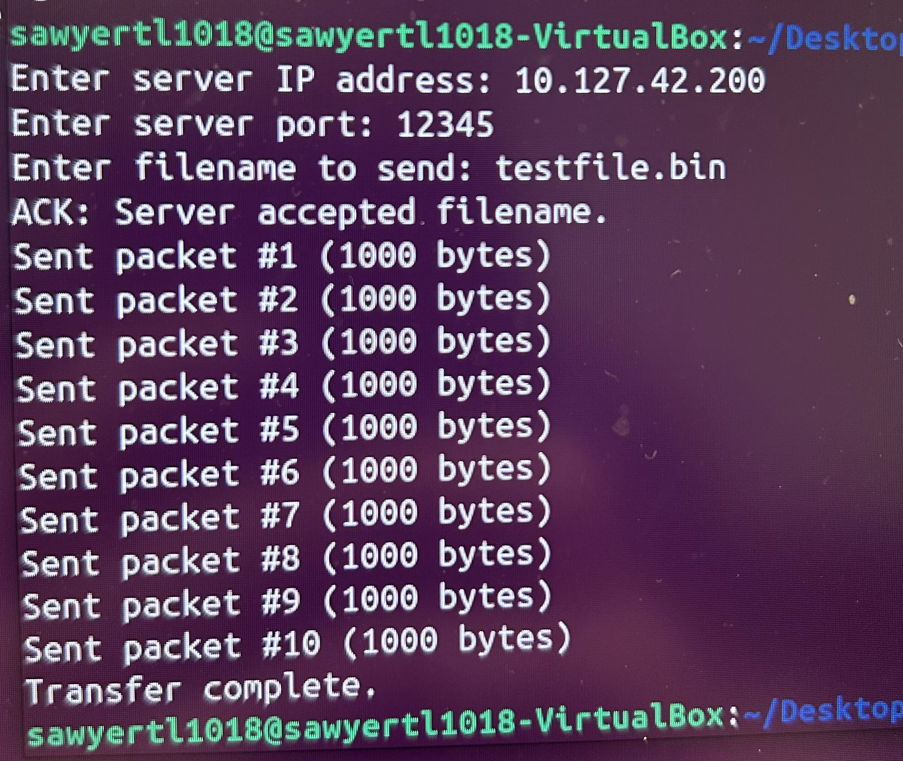

Portfolio
=========

Programming Projects
--------------------

*For access to my private project repositories, please [email me](mailto:csneal@student.csuniv.edu) with the subject line, GitHub Access.

---
### [Windows Cybersecurity Compliance Check using Python | CSCI 301](project1)

---
### [Large Map | CSCI 315](project1)

)

---
### [Final Project| CSCI 325](project1)

---
### [Final Project | CSCI 332](project1)

---

Ethics Papers
-------------

### [Ethics of Artificial Intelligence](/pdf/sample_presentation.pdf)

-   **Class:** CSCI-301 
-   **Grade:** 100

### [Responsibility in Automated Software Testing](/pdf/sample_presentation.pdf)

-   **Class:** CSCI-315
-   **Grade:** 75

---

Page template forked from <a href="https://github.com/csu-cs/csci-portfolio">CSU-CS</a>

<!-- Remove above link if you don't want to attributive -->
